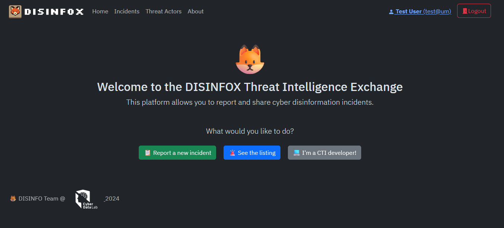
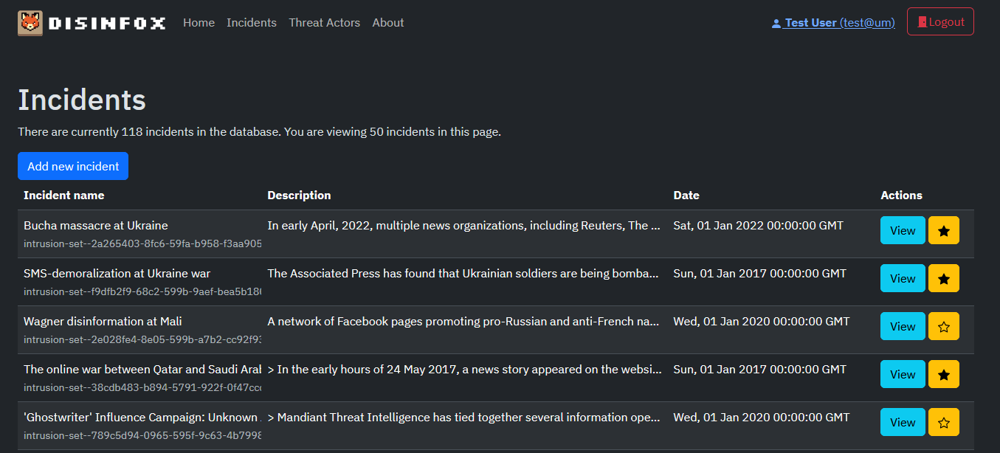
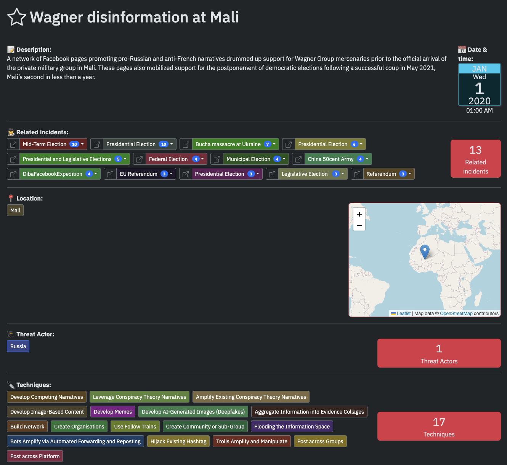
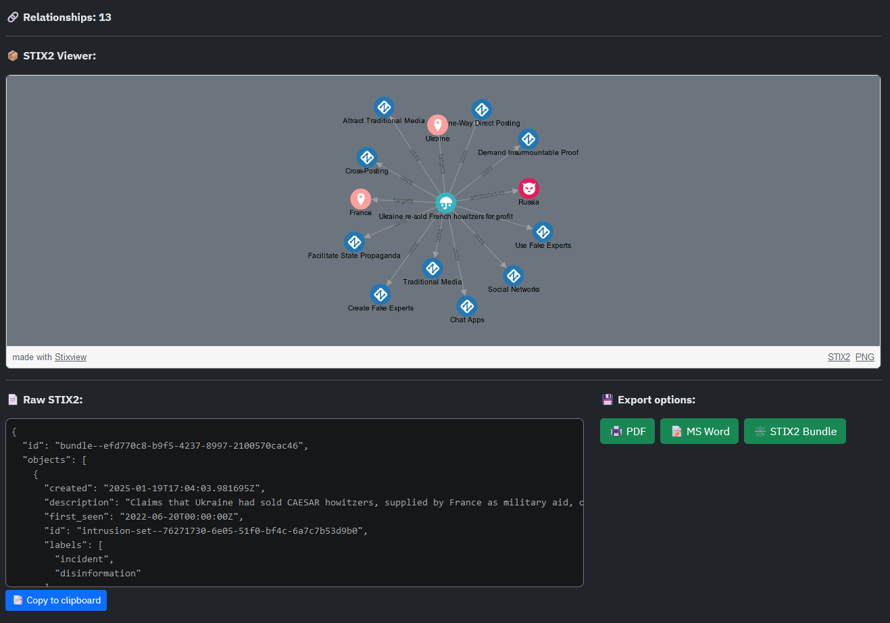
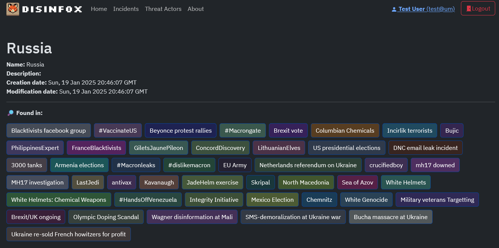
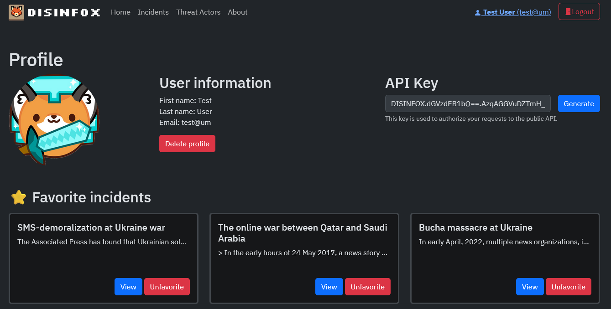

# 🦊 DISINFOX (DISINFOrmation threat eXchange)

DISINFOX is an **open-source threat intelligence exchange platform** designed to enable the real-time, interoperable exchange of disinformation incidents with client-side CTI consumers. By using CTI standards and methodologies, DISINFOX provides a **centralized platform for storing, managing, and analyzing disinformation incidents, integrating seamlessly with existing CTI tools** to enhance the detection, investigation, and mitigation of this evolving threat. To achieve this, the following sub-objectives have been defined.



## 🧱 Installation and deployment

First, clone the repository:

```bash
git clone https://github.com/CyberDataLab/disinfox
cd disinfox
```

Now, make a copy of the `example.env` file and name it `.env` and **change the `changeme` values**:

```bash
cp example.env .env
```

There are several ways of setting up DISINFOX, however, it is recommended to use the `setup.sh`, which runs the platform with a demo configuration.

```bash
bash setup.sh
```

This bash file will include a default user + the incidents available in the dataset, and will automatically launch the docker environment. You can use the `--destroy` flag to destroy the database and redo the setup.

## 👽 Other deployments

You can also run the platform _empty_ by just running (if setup.sh was run, the database volume should be erased):

```bash
docker compose up
```

or, if you want to run the readonly version where no changes can be performed, use:

```bash
docker compose -f docker-compose-readonly.yaml up
```

The docker-compose files with `-dev` variants are recommended if you intend to make changes in the code.

## 🕹️ Use

After performing the installation, the DISINFOX's web page is available at <http://localhost/> by default or at the port established in the `FRONTEND_EXTERNAL_PORT` at the `.env` file.

If you have used the `setup.sh` script, you can log in with the credentials stablished (if not changed `changeme@example:changeme`).

The _Incidents_ page will show the incidents available in the database, and you can click on them to see the details and favorite them:


Once you click on the incident, you can see the details: the title, description, threat actor, affected countries and used techniques. Additionally, a graph with of the incident's objects is shown. You can also see the raw STIX2 Bundle of the incident or export it to PDF, Microsoft Word, or JSON (STIX2 Bundle):




If interested, you can select any of the related Threat Actors, to see their details and related incidents:



In the _Profile_ page, you can see your user information, API key for the Public API, and the incidents you have favorited:



## 📚 Public API

DISINFOX provides a public API to obtain the new objects created in the platform. The API is deployed by default at <http://localhost:8080/incidents> or at the port established in the `API_EXTERNAL_PORT` at the `.env` file.

To use the API, you need to authenticate with the API key provided in the _Profile_ page. The API key is unique to each user and can be regenerated at any time. The API key must be included in the `Authorization` header of the request. Also, is necessary to use the `newer_than` parameter to get the new incidents created/modified after the specified date. The date must be in the ISO 8601 format. The following is an example of a request to the API:

```http
GET /incidents?newer_than=2024-10-30T01:35:21.128381Z HTTP/1.1
Host: localhost:8080
Authorization: <API_KEY>
Accept: */*
```
If done correctly, the API will return a JSON object with the new incidents created/modified after the specified date. Here is an example of body of the response:

```json
{
	"incidents": [
		{
			"created": "2024-12-16T00:56:33.476896Z",
			"description": "This is the description",
			"first_seen": "2024-12-13T00:00:00Z",
			"id": "intrusion-set--fe842862-3fa6-5385-b001-17108193592b",
			"labels": [
				"incident",
				"disinformation"
			],
			"modified": "2024-12-16T00:56:33.476896Z",
			"name": "This is our test yeah",
			"spec_version": "2.1",
			"type": "intrusion-set"
		},
		{
			"created": "2024-12-16T00:55:32.167569Z",
			"description": "This is the description",
			"first_seen": "2024-12-13T00:00:00Z",
			"id": "intrusion-set--86eba414-15d2-5e58-a299-dcbeb0a19607",
			"labels": [
				"incident",
				"disinformation"
			],
			"modified": "2024-12-16T00:55:32.167569Z",
			"name": "This is our test 2",
			"spec_version": "2.1",
			"type": "intrusion-set"
		},
		{
			"created": "2024-12-16T00:46:29.975529Z",
			"description": "This is the description",
			"first_seen": "2024-12-13T00:00:00Z",
			"id": "intrusion-set--3f6f81a1-a1c4-52b4-8622-612d64831c70",
			"labels": [
				"incident",
				"disinformation"
			],
			"modified": "2024-12-16T00:46:29.975529Z",
			"name": "This is our test",
			"spec_version": "2.1",
			"type": "intrusion-set"
		},
		{
			"created": "2024-11-30T01:35:21.154275Z",
			"description": "The Russian disinformation machine is spinning new and recycled narratives to claim that Ukraine is re-selling French weapon systems on the black market and ending up in Russian hands. This narrative aims to convince Western audiences that Ukraine is not to be trusted with sophisticated weapons supplied by the West while casting a shadow on France’s role in providing military aid. For Russian audiences, the narrative highlights Russian “military might” prevailing against the “powerless West.” For Ukrainians, the narrative is intended to raise fears that the West will stop providing weapon systems to Ukraine.",
			"first_seen": "2022-01-01T00:00:00Z",
			"id": "intrusion-set--c76fcb3f-e669-5062-957b-bdeeb69eb34f",
			"labels": [
				"incident",
				"disinformation"
			],
			"modified": "2024-11-30T01:35:21.154275Z",
			"name": "Ukraine re-sold French howitzers for profit",
			"spec_version": "2.1",
			"type": "intrusion-set"
		},
        ...
}
```